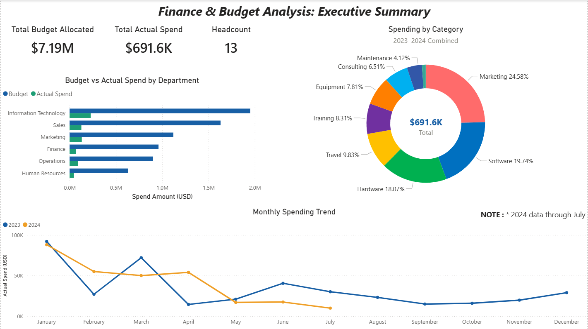
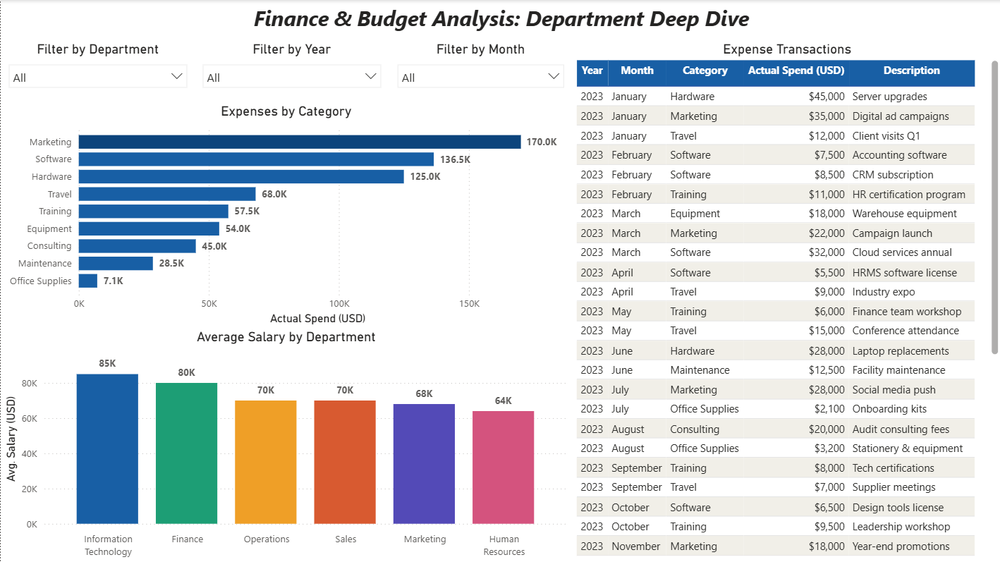

# 💰 Finance & Budget Analysis — SQL + Power BI



> A complete end-to-end Data Analytics project analyzing a company's departmental budgets, expenses, and employee costs using **PostgreSQL** for data storage & analysis and **Power BI** for interactive dashboards.

---

## 📑 Table of Contents

1. [Problem Statement](#-problem-statement)
2. [Project Objective](#-project-objective)
3. [Data Understanding](#-data-understanding)
4. [Data Cleaning Process](#-data-cleaning-process)
5. [Data Modelling](#-data-modelling)
6. [DAX Measures](#-dax-measures)
7. [Dashboard Overview](#-dashboard-overview)
8. [Data Insights](#-data-insights)
9. [Recommendations](#-recommendations)
10. [Skills Demonstrated](#-skills-demonstrated)
11. [Files in This Repository](#-files-in-this-repository)

---

## 🔍 Problem Statement

Companies often struggle to track whether departments are staying within their allocated budgets. Without clear visibility into spending patterns, categories, and trends, leadership cannot make informed financial decisions. There is a need for a centralized system that:

- Tracks **budget vs actual spending** per department
- Identifies **over-budget or at-risk** departments early
- Reveals **which expense categories** drain the most resources
- Shows **monthly spending trends** for forecasting
- Provides a clear picture of **salary costs** across departments

---

## 🎯 Project Objective

The goal of this project is to build a complete **Finance & Budget Analytics solution** that answers the following business questions:

| # | Business Question |
|---|-------------------|
| 1 | What is the total budget vs actual spending per department? |
| 2 | How does spending compare to budget year by year? |
| 3 | Which expense category costs the company the most? |
| 4 | Which departments are over budget? |
| 5 | What is the monthly spending trend? |
| 6 | What is the average salary and headcount per department? |

---

## 📊 Data Understanding

The dataset is a **simulated company financial dataset** created and stored in **PostgreSQL**. It consists of 4 tables:

### 🗂️ Table 1: `departments`
Stores the list of company departments and their locations.

| Column | Type | Description |
|--------|------|-------------|
| department_id | SERIAL (PK) | Unique department identifier |
| department_name | VARCHAR | Name of the department |
| location | VARCHAR | City where the department is based |

### 🗂️ Table 2: `employees`
Stores employee details linked to their departments.

| Column | Type | Description |
|--------|------|-------------|
| employee_id | SERIAL (PK) | Unique employee identifier |
| full_name | VARCHAR | Employee's full name |
| department_id | INT (FK) | Links to departments table |
| job_title | VARCHAR | Employee's role |
| hire_date | DATE | Date of joining |
| salary | NUMERIC | Annual salary |

### 🗂️ Table 3: `budget`
Stores the annual budget allocated to each department.

| Column | Type | Description |
|--------|------|-------------|
| budget_id | SERIAL (PK) | Unique budget record identifier |
| department_id | INT (FK) | Links to departments table |
| fiscal_year | INT | Year of the budget |
| allocated_amount | NUMERIC | Budget allocated in USD |

### 🗂️ Table 4: `expenses`
Stores all actual expense transactions by department.

| Column | Type | Description |
|--------|------|-------------|
| expense_id | SERIAL (PK) | Unique expense identifier |
| department_id | INT (FK) | Links to departments table |
| expense_date | DATE | Date of the expense |
| category | VARCHAR | Type of expense (Travel, Software, etc.) |
| amount | NUMERIC | Amount spent in USD |
| description | TEXT | Brief description of the expense |

### 📈 Dataset Summary

| Metric | Value |
|--------|-------|
| Total Departments | 6 |
| Total Employees | 13 |
| Budget Records | 18 (3 years × 6 departments) |
| Expense Transactions | 41 |
| Data Coverage | 2022 – 2024 |
| Total Budget (All Years) | $7,190,000 |
| Total Expenses Recorded | $691,600 |

---

## 🧹 Data Cleaning Process

Data cleaning was performed entirely in **PostgreSQL** using SQL queries. The following checks were carried out:

### ✅ Check 1 — NULL Values in Employees
```sql
SELECT * FROM employees
WHERE full_name IS NULL OR department_id IS NULL
   OR salary IS NULL OR hire_date IS NULL;
```
**Result:** 0 rows — No missing values found ✅

### ✅ Check 2 — NULL Values in Expenses
```sql
SELECT * FROM expenses
WHERE department_id IS NULL OR amount IS NULL
   OR expense_date IS NULL;
```
**Result:** 0 rows — No missing values found ✅

### ✅ Check 3 — Duplicate Expenses
```sql
SELECT department_id, expense_date, amount, description, COUNT(*) AS occurrences
FROM expenses
GROUP BY department_id, expense_date, amount, description
HAVING COUNT(*) > 1;
```
**Result:** 0 rows — No duplicate records found ✅

### ✅ Check 4 — Salary Sanity Check
Verified all salaries are within realistic ranges for each job title.
**Result:** Salaries range from $50,000 to $95,000 — all valid ✅

### ✅ Check 5 — Expense Range Check
```sql
SELECT MIN(amount) AS lowest, MAX(amount) AS highest, ROUND(AVG(amount),2) AS average
FROM expenses;
```
**Result:** Min $1,800 | Max $52,000 | Avg $16,868 — all valid ✅

> **Conclusion:** The dataset was clean with no nulls, no duplicates, and no outliers. No corrections were needed — data was ready for analysis.

---

## 🔗 Data Modelling

The data model follows a **Star Schema** — one central fact table (`expenses`) connected to dimension tables through `department_id`.

```
                    ┌─────────────┐
                    │ departments │
                    │─────────────│
                    │ department_id (PK)
                    │ department_name
                    │ location    │
                    └──────┬──────┘
           ┌───────────────┼───────────────┐
           │               │               │
    ┌──────▼──────┐  ┌─────▼──────┐  ┌────▼───────┐
    │  expenses   │  │   budget   │  │  employees │
    │─────────────│  │────────────│  │────────────│
    │ expense_id  │  │ budget_id  │  │employee_id │
    │department_id│  │department_id  │department_id
    │ expense_date│  │ fiscal_year│  │ full_name  │
    │ category    │  │ allocated_ │  │ job_title  │
    │ amount      │  │   amount   │  │ hire_date  │
    │ description │  └────────────┘  │ salary     │
    └─────────────┘                  └────────────┘
```

**Relationships in Power BI:**

| From Table | Column | To Table | Column | Cardinality |
|-----------|--------|----------|--------|-------------|
| expenses | department_id | departments | department_id | Many to One |
| budget | department_id | departments | department_id | Many to One |
| employees | department_id | departments | department_id | Many to One |

---

## 📐 DAX Measures

The following DAX measures were created in Power BI to power the dashboard KPIs:

### Total Budget
```dax
Total Budget = SUM(budget[allocated_amount])
```

### Total Actual Spend
```dax
Total Actual Spend = SUM(expenses[amount])
```

### Remaining Budget
```dax
Remaining Budget = [Total Budget] - [Total Actual Spend]
```

### Budget Utilization %
```dax
Budget Utilization % = 
DIVIDE([Total Actual Spend], [Total Budget], 0) * 100
```

### Total Employees
```dax
Total Employees = COUNT(employees[employee_id])
```

### Average Salary
```dax
Average Salary = AVERAGE(employees[salary])
```

---

## 📊 Dashboard Overview

The Power BI dashboard consists of **2 interactive report pages:**

---

### Page 1 — Executive Summary


**Visuals included:**
- 📌 **3 KPI Cards** — Total Budget | Total Spent | Total Employees
- 📊 **Clustered Bar Chart** — Budget vs Actual Spend by Department
- 🍩 **Donut Chart** — Spending breakdown by Category
- 📈 **Line Chart** — Monthly Spending Trend

---

### Page 2 — Department Deep Dive


**Visuals included:**
- 🔽 **Dropdown Slicer** — Filter entire page by Department
- 📊 **Bar Chart** — Expenses by Category
- 📋 **Table** — Full Expense Transaction details
- 📊 **Column Chart** — Average Salary by Department

---

## 💡 Data Insights

### 1. Budget Utilization is Very Low Overall
The company spent only **$691,600 out of $7,190,000** total budget across all years — a utilization rate of approximately **9.6%**. This suggests either budgets are over-allocated or actual expenses are heavily under-reported for 2022.

### 2. IT Department Has the Highest Spending
The **Information Technology** department consistently records the highest expenses, driven by Hardware purchases (server upgrades, data center expansion) and Software (cloud services, migration costs).

### 3. Marketing is the Top Expense Category
Across all departments, **Marketing** accounts for the largest share of expenses (~24.58%), followed by **Software** (~19.74%) and **Hardware** (~18.07%).

### 4. Spending Peaks in January
The monthly trend shows a significant spike in **January** both in 2023 and 2024, driven by large hardware and marketing purchases at the start of the fiscal year.

### 5. IT Has the Highest Average Salary
The **Information Technology** department has the highest average salary (~$85,000), reflecting the premium cost of technical talent, followed closely by **Finance** (~$80,000).

### 6. Human Resources Has the Lowest Budget Utilization
**HR** spent the least relative to its budget, suggesting cost efficiency or underspending in training and development programs.

---

## ✅ Recommendations

Based on the analysis, the following recommendations are made to leadership:

| # | Recommendation |
|---|----------------|
| 1 | **Review IT Hardware spending** — Large hardware purchases dominate costs. Evaluate whether cloud alternatives can reduce capital expenditure. |
| 2 | **Optimize Marketing budget allocation** — Marketing is the top expense category. Track ROI per campaign to ensure spend is justified. |
| 3 | **Investigate January spending spikes** — Frontloading large purchases in January may cause cash flow issues. Consider spreading major purchases across quarters. |
| 4 | **Re-evaluate 2022 budget allocations** — Near-zero 2022 expense data suggests budgets may have been set too high or data is incomplete. Validate with finance team. |
| 5 | **Increase HR training investment** — HR is significantly under its budget. Investing in employee training and development can improve retention. |
| 6 | **Monitor Software subscriptions** — Software is the second highest category. An audit of all active subscriptions can identify unused tools to eliminate. |

---

## 🛠️ Skills Demonstrated

| Category | Skills |
|----------|--------|
| **Database** | PostgreSQL, Database Design, Star Schema |
| **SQL** | DDL (CREATE TABLE), DML (INSERT), JOINs, GROUP BY, Aggregations, CASE WHEN, Subqueries, EXTRACT, TO_CHAR, COALESCE |
| **Data Cleaning** | NULL checks, Duplicate detection, Sanity checks |
| **Power BI** | Data import via ODBC, Power Query, Data Modelling, Relationships, DAX Measures, Slicers, KPI Cards, Bar/Column/Line/Donut Charts, Table Visual |
| **Analytics** | KPI analysis, Budget variance analysis, Trend analysis, Category analysis |
| **Soft Skills** | Business problem framing, Data storytelling, Insight generation, Recommendations |

---

## 📁 Files in This Repository

```
finance-budget-analysis/
│
├── 📂 sql/
│   ├── 1_Create_Database.sql          # Creates the finance_project database
│   ├── 2A_Create_Tables.sql           # Creates all 4 tables with relationships
│   ├── 2B_Insert_Data.sql             # Inserts all data (departments, employees, budget, expenses)
│   ├── 2C_Verify_Data.sql             # Verifies row counts in all tables
│   ├── 3A_Explore_Each_Table.sql      # Data exploration queries with JOINs
│   ├── 3B_Data_Quality_Checks.sql     # NULL checks, duplicate checks, sanity checks
│   ├── 4A_Question_1.sql              # KPI: Budget vs Actual Spend per Department
│   ├── 4B_Question_2.sql              # KPI: Year-by-year budget vs spending
│   ├── 4C_Question_3.sql              # KPI: Top expense categories
│   ├── 4D_Question_4.sql              # KPI: Over/Near/Under budget status
│   ├── 4E_Question_5.sql              # KPI: Monthly spending trend
│   └── 4F_Question_6.sql              # KPI: Salary & headcount by department
│
├── 📂 images/
│   ├── executive_summary.png          # Screenshot of Page 1 dashboard
│   └── department_deep_dive.png       # Screenshot of Page 2 dashboard
│
├── Finance_Budget_Dashboard.pbix      # Power BI Dashboard file
└── README.md                          # Project documentation (this file)
```

---

## 🚀 How to Run This Project

### Prerequisites
- PostgreSQL installed (v14 or above)
- pgAdmin installed
- Power BI Desktop installed
- PostgreSQL ODBC Driver installed

### Steps

**1. Set up the database:**
```bash
# Open pgAdmin → Query Tool → run files in this order:
1_Create_Database.sql
2A_Create_Tables.sql
2B_Insert_Data.sql
2C_Verify_Data.sql
```

**2. Verify the data:**
```bash
# Run in pgAdmin Query Tool:
3A_Explore_Each_Table.sql
3B_Data_Quality_Checks.sql
```

**3. Run KPI queries:**
```bash
# Run any of the 4A through 4F SQL files to see business insights
```

**4. Open the dashboard:**
```bash
# Open Finance_Budget_Dashboard.pbix in Power BI Desktop
# Update the data source connection to your local PostgreSQL if needed:
# Home → Transform Data → Data Source Settings → Change Source → localhost
```

---

## 👤 Author

**Dhammadeep Anil Ramteke**

- 💼 LinkedIn: https://www.linkedin.com/in/dhammadeep-ramteke/
- 🐙 GitHub: https://github.com/DHAMMADEEPRAMTEKE30
- 📧 Email: ramtekedhamma30@gmail.com / dhammadeepramteke2702@gmail.com

---

*This project was built as part of a Data Analyst portfolio to demonstrate end-to-end skills in SQL, database design, data cleaning, KPI analysis, and Power BI dashboard development.*
